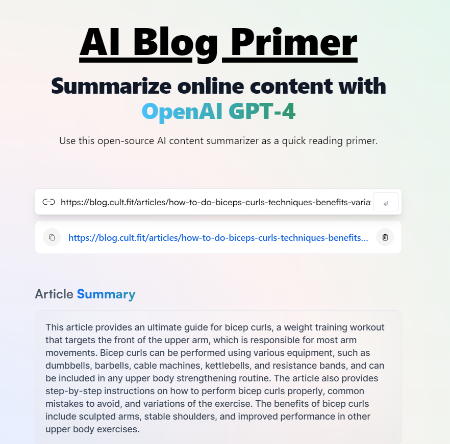

# Blog Summarizer App

## Introduction
The Blog Summarizer App is a tool that allows users to easily extract concise summaries from blog content shared via a link. It is designed to help users quickly grasp the key points and main ideas of the provided content without having to read the entire article.

## Features
- Summarizes blog content shared via a URL
- Provides concise and relevant summaries
- User-friendly interface for easy navigation
- Authentication and Authorization with JWT

## Getting Started

### Usage
To use the Blog Summarizer App, simply visit [App URL] in your web browser.

1. When you come across a blog post you'd like to summarize, copy the URL.
2. Paste the copied URL into the provided input field on the app's homepage.
3. Click the "Summarize" button.
4. The app will then generate a concise summary of the blog content for you to read.

## Demo
[https://ai-blog-primer.onrender.com/]

## Supported Platforms
- Web
- iOS
- Android

## Contributing
We welcome contributions from the community! If you'd like to contribute, please follow these steps:

1. Fork the repository
2. Create a new branch for your feature or bug fix
3. Make your changes and ensure the code passes all tests
4. Submit a pull request

